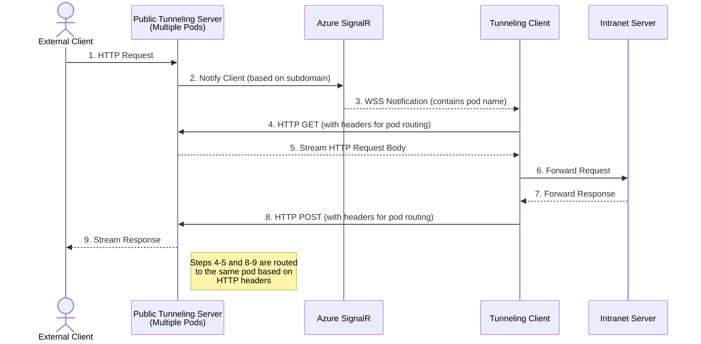
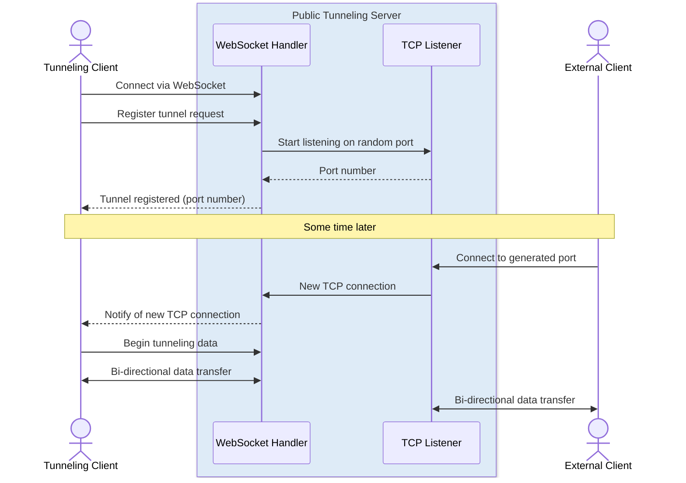
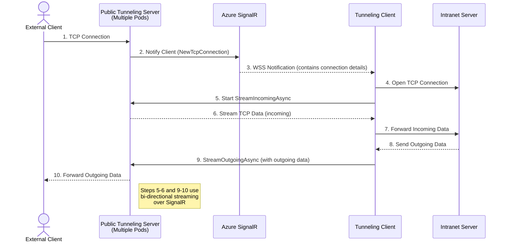

# ⚡ Tunnelite

[](https://github.com/cristipufu/tunnelite/actions/workflows/ci.yml)
[](https://github.com/cristipufu/tunnelite/actions/workflows/deploy.yml)
[](https://www.nuget.org/packages/Tunnelite/)
[](https://www.nuget.org/packages/Tunnelite/)
[](https://github.com/cristipufu/tunnelite/releases/latest)
[](LICENSE)

Tunnelite is a .NET tool that lets you set up a secure connection between a public web address and an application running on your local machine. It effectively makes your local app accessible from the internet.

```bash
dotnet tool install --global Tunnelite
tunnelite http://localhost:3000
```

**Website:** [tunnelite.com](https://tunnelite.com) · **Webhook tester:** [webhooks.tunnelite.com](https://webhooks.tunnelite.com)

## Contents

- [Use Cases](#-use-cases)
- [Installation](#-installation)
- [Usage](#-usage)
- [How It Works](#-how-it-works)
- [Self-Hosting](#-self-hosting)
- [Packages](#-packages)
- [Tests](#-tests)
- [License](#-license)

## 🚀 Use Cases

- Exposing locally-hosted web applications to the internet for testing or demo purposes.
- Quickly sharing dev builds during hackathons.
- Testing and debugging webhook integrations.
- Providing internet access to services running behind firewalls without exposing incoming ports.

## 📦 Installation

### .NET tool

Requires the .NET 10 SDK. To install Tunnelite as a global tool, use the following command:

```bash
dotnet tool install --global Tunnelite
```

To update an existing installation:

```bash
dotnet tool update --global Tunnelite
```

### Standalone binaries

Every [release](https://github.com/cristipufu/tunnelite/releases/latest) also ships a single self-contained executable, built with NativeAOT, that needs no .NET runtime installed:

| Platform | Archive |
| --- | --- |
| Linux x64 | `tunnelite-linux-x64.tar.gz` |
| Linux arm64 | `tunnelite-linux-arm64.tar.gz` |
| macOS Intel | `tunnelite-osx-x64.tar.gz` |
| macOS Apple Silicon | `tunnelite-osx-arm64.tar.gz` |
| Windows x64 | `tunnelite-win-x64.zip` |

A `SHA256SUMS` file is attached to each release for verification.

## 💻 Usage

Once installed, you can use the `tunnelite` command to create a tunnel to your local application:

```bash
tunnelite http://localhost:3000
```

This command returns a public URL with an auto-generated subdomain.


| Argument / option | Description |
| --- | --- |
| `<localUrl>` | The local URL to tunnel to. Use `http://` or `https://` for web applications, or `tcp://host:port` for raw TCP (self-hosted servers only). |
| `--publicUrl <url>` | The tunnel server to connect to. Defaults to `https://tunnelite.com`. |
| `--log <level>` | Client log verbosity: `Trace`, `Debug`, `Information`, `Warning`, `Error` or `Critical`. |

While the tunnel is running, press `c` to clear the screen and `q` to quit.

## 🔍 How It Works

Tunnelite creates a bridge between your local application and the internet using a WebSocket connection. It streams incoming data from a public URL directly to your local server, making your local app accessible from anywhere.

The managed version of Tunnelite supports HTTP(S), WebSocket (WS/WSS) and Server-Sent Events tunneling. If you need TCP tunneling, you'll have to host the server yourself.

### HTTP connection



<details>
<summary><b>TCP overview</b></summary>

<br/>



</details>

<details>
<summary><b>TCP connection</b></summary>

<br/>



</details>

## 🏠 Self-Hosting

Tunnelite allows you to self-host the server, giving you full control over your tunneling infrastructure. To set up your own Tunnelite server, you'll need:

- Wildcard SSL certificate for your domain
- Wildcard DNS record pointing to your server's IP address

These allow Tunnelite to create secure subdomains for your tunnels and properly route traffic to your self-hosted server. The server project is `src/Tunnelite.Server`; the [deploy workflow](.github/workflows/deploy.yml) shows how the managed instance is published to Azure App Service.

Once your server is up, point the client at it:

```bash
tunnelite http://localhost:3000 --publicUrl https://your-server-domain
```

## 📚 Packages

| Package | Description |
| --- | --- |
| [Tunnelite](https://www.nuget.org/packages/Tunnelite/) | The `tunnelite` command-line tool. |
| [Tunnelite.Sdk](https://www.nuget.org/packages/Tunnelite.Sdk/) | `HttpTunnelClient` and `TcpTunnelClient` for opening tunnels from your own .NET code. |
| [Tunnelite.AspNetCore](https://www.nuget.org/packages/Tunnelite.AspNetCore/) | `app.UseTunnelite()` middleware that tunnels an ASP.NET Core app as soon as it starts. |

```csharp
var app = builder.Build();

app.UseTunnelite(); // prints the public URL once the tunnel is connected

app.Run();
```

## 🧪 Tests

`test/Tunnelite.Tests` starts the tunnel server and a local app in-process and drives real traffic through the tunnel: HTTP, Server-Sent Events, WebSockets (including large and fragmented messages), TCP, and a client speaking the original WebSocket wire format. Set `TUNNELITE_CLI` to a built `tunnelite` binary to also run the CLI end-to-end.

```bash
dotnet test test/Tunnelite.Tests
```

CI runs the suite on every pull request, plus a NativeAOT publish of the CLI that is tested the same way.

## 📄 License

This project is licensed under the [MIT License](LICENSE).
